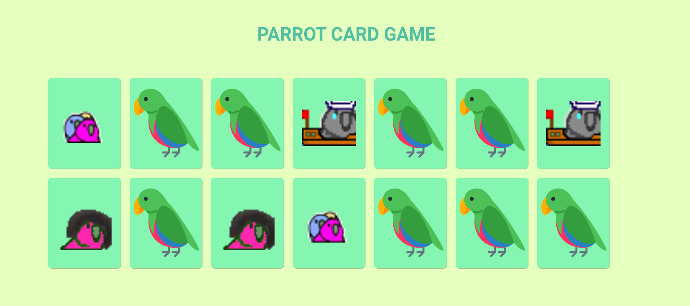
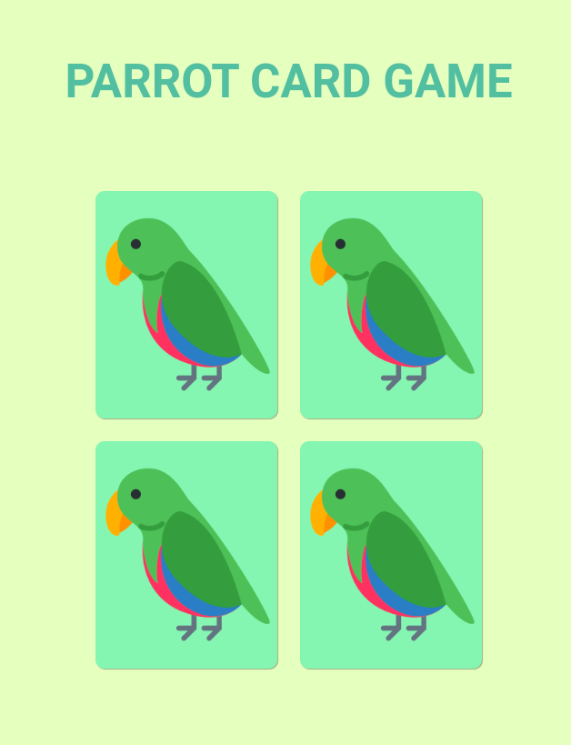

# Parrot Card Game 🦜

Bem-vindo ao **Parrot Card Game**, um jogo da memória divertido e interativo com tema de papagaios! O objetivo é encontrar os pares de cartas com o menor número de tentativas possíveis.

## 🎮 Demo

Você pode conferir o jogo ao vivo clicando [aqui](https://9xx2d6.csb.app/).

## 📜 Sobre o Projeto

Este projeto foi desenvolvido para praticar e melhorar habilidades de front-end, utilizando as principais tecnologias web:

- **HTML**: Estrutura do jogo.
- **CSS**: Estilização e design responsivo.
- **JavaScript**: Lógica do jogo, manipulação do DOM e interatividade.

## 🛠️ Funcionalidades

- Interface simples e amigável.
- Animações ao virar as cartas.
- Verificação automática de pares.

## 🚀 Como Jogar

1. Clique em duas cartas para virá-las.
2. Se as cartas combinarem, elas permanecem viradas.
3. Se as cartas não combinarem, elas se viram de volta.
4. O objetivo é encontrar todos os pares no menor número de movimentos possível.

## 🖼️ Capturas de Tela
- Versão Desktop

------------------------------------------------
- Versão Moblie

